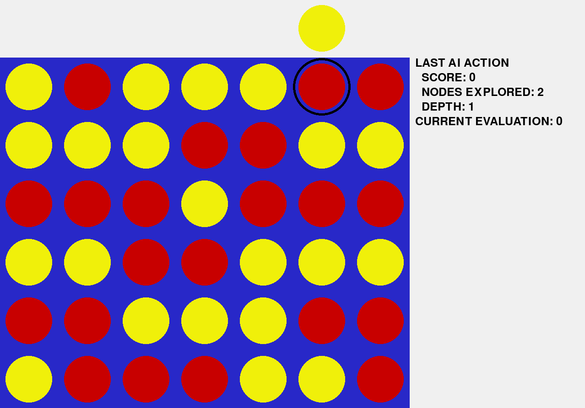
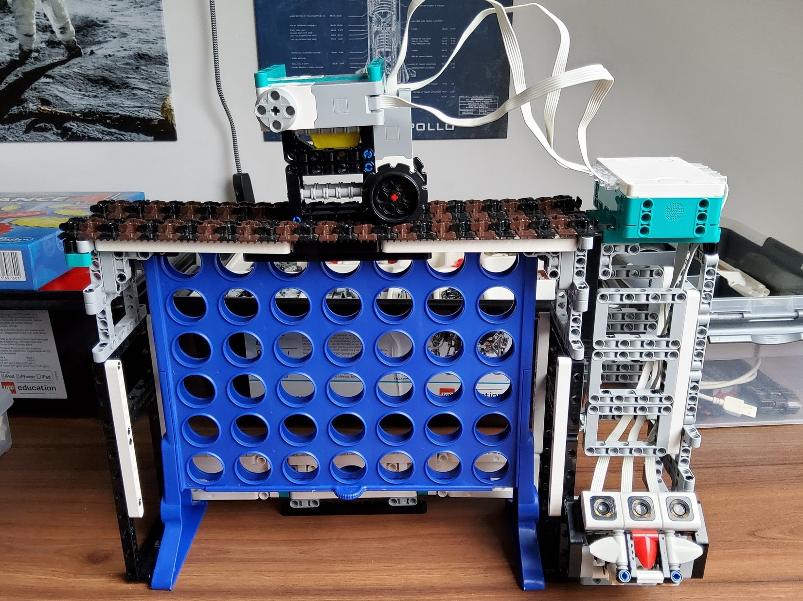

# Connect 4

The Connect 4 game with an AI.

The AI is implemented using the minimax algorithm with alpha-beta pruning.

It requires the [pygame](https://www.pygame.org/) library to run.

Usage: `python3 main.py`

This was also made to be played using a LEGO robot I built myself using set 51515 and some spare parts :

